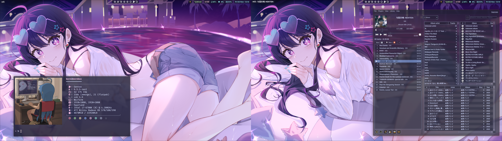
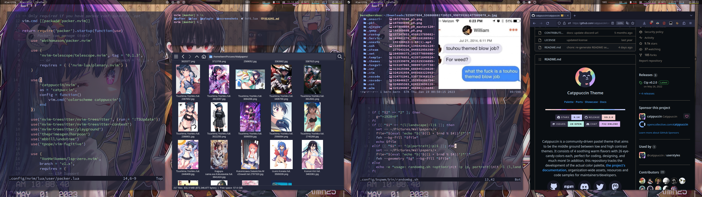
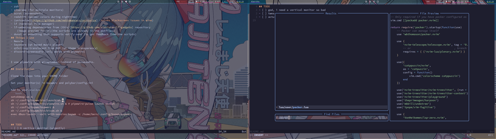

<h1 align="center">
    <br>
    My Dotfiles
    <br>
</h1>

<h4 align="center">*mostly stolen stuff from other r/unixporn users*</h4>



## About
My BSPWM dotfiles from my main desktop.
I don't have a login gui, I just run it with startx from tty. Comes with a few scripts that I've made for my personal needs, such as a random background picker, a window swallower, a window hider, etc.

## Dependencies:
- BSPWM
- Polybar
- SXHKD
- Picom (I am using [pijulius](https://github.com/pijulius/picom)' version, for the cool animations)
- rofi or dmenu for launching apps, both are in the config
- Alacritty or Kitty (or whichever terminal you prefer)
- xsetroot (for the cursor)
- xsettingsd
- wmctrl (for polywins)
## Misc packages:
- zsh
- xinerama (for multiple monitors)
- scrot (screenshots)
- redshift (warmer colors during nighttime)
- (uniconize)[https://github.com/neXromancers/uniconize] (solves blackscreen issues in wine)
- lf (terminal file manager)
- lf-ueberzug dependencies from (this)[https://github.com/slavistan/lf-gadgets] repository
	(image preview for lf)(the scripts are already in the dotfiles)
- dunst or something that supports notify-send (to get feedback from the scripts)
## Things I use
- Neovim
- Sayonara (qt based music player)
- qt5ct-svg-translucent from AUR (qt theme transparency)
- discord-screenaudio (only works with pipewire)


I use pipewire with wireplumber instead of pulseaudio.

## Installation

Clone the repo with the `--recurse-submodules` option into your $HOME folder

Set your monitor(s) in bspwmrc and polybar/config.ini

Add to your.xinitrc
```bash
setxkbmap us &
sh ~/.config/bspwm/bin/launch.sh &
sh ~/.config/bspwm/bin/pipewire.sh & # pipewire-pulse launch script
sh ~/.config/bspwm/bspwmrc &
sh ~/.config/bspwm/bin/bicom.sh &
exec dbus-launch --exit-with-session bspwm -c /home/bern/.config/bspwm/bspwmrc
```

## TODO
- [ ] A vertical monitor (urgently)

## Screenshots
<details>
    <summary>Spoiler</summary>





</details>
